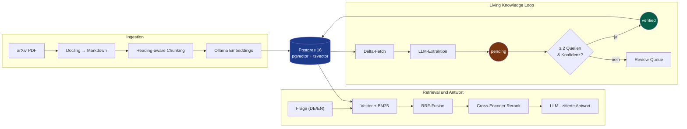
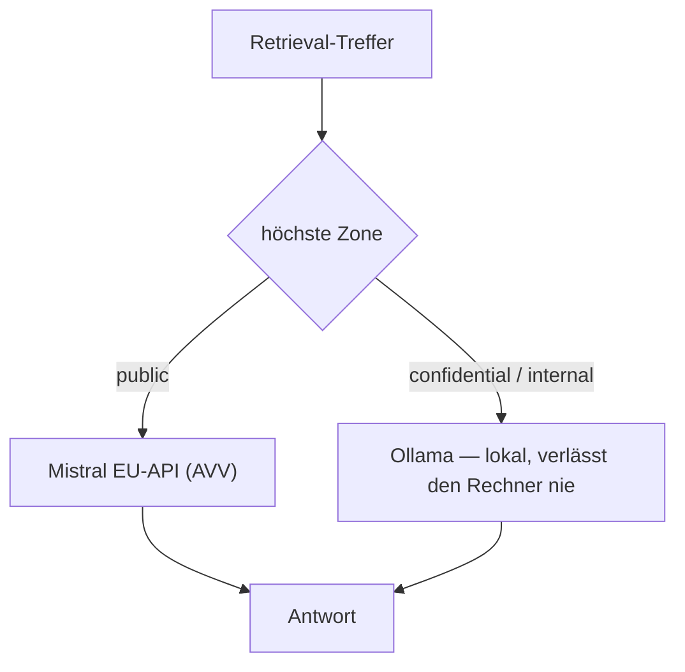

<div align="center">

# 🧠 KI-Wissensmanagement-System

**Ein DSGVO-konformes RAG-System über KI-Forschung — mit einem Wissens-Graphen,
der sich selbst aktualisiert und verifiziert.**

Frag in natürlicher Sprache (DE/EN) einen Korpus aus arXiv-Papers und erhalte
**belegte Antworten mit Zitaten**. Ein rekursiver Loop holt neue Publikationen,
extrahiert Fakten per LLM und übernimmt sie **erst nach Mehr-Quellen-Verifikation**
in einen interaktiven Wissens-Graphen.


</div>

---

## Warum dieses Projekt

Die meisten RAG-Demos beantworten Fragen. Dieses System geht drei Schritte weiter und
löst die Probleme, die im echten Betrieb wehtun:

- **🔒 Privacy by Architecture** — zwei Datenzonen, im Code getrennt. Öffentliche
  Forschung darf über die EU-API laufen; vertrauliche Dokumente werden **garantiert
  nur lokal** (Ollama) verarbeitet. Ein Zonen-Router entscheidet pro Anfrage; ein Test
  beweist, dass `confidential` nie einen externen Call auslöst.
- **📚 Belegte Antworten statt Halluzination** — jede Aussage trägt ihre Quelle
  (`[Titel, Abschnitt]`); ohne Treffer sagt das System „dazu liegt keine Quelle vor".
- **🌱 Selbst-aktualisierender Wissens-Graph** — der Kern. Neue Fakten werden per LLM
  extrahiert, starten als `pending` und werden **nur bei ≥ 2 unabhängigen Quellen**
  automatisch verifiziert. Kein Silent-Overwrite, Provenienzpflicht, Review-Queue.

Gebaut mit dem Anspruch von Produktionscode: getypt, getestet, migriert, in Docker,
mit CI, Secret-Scanning und dokumentierten Architektur­entscheidungen (ADRs).

---

## Auf einen Blick

| | |
|---|---|
| **Korpus** | 16 arXiv-Papers · **1.801** Chunks · multilinguale Embeddings (1024-dim) |
| **Retrieval** | Hybrid (Vektor + BM25) → Reciprocal Rank Fusion → optionaler Cross-Encoder |
| **Qualität** | **Hit-Rate@5 = 0,94** · p95-Latenz **~220 ms** (Golden-Set, DE + EN) |
| **Wissens-Graph** | LLM-Extraktion → `pending` → 2-Quellen-Promotion → `verified` |
| **Zugriff** | Web-UI · REST-API (`/docs`) · **MCP-Server** für Claude Desktop |
| **Qualitätssicherung** | 54 Tests · `ruff` · `mypy` · `gitleaks` · GitHub Actions |

---

## Architektur



### Privacy by Architecture — der Zonen-Router

Die höchste Sensitivität der Treffer entscheidet, welches Modell antwortet. Das ist
kein Prompt-Hinweis, sondern eine harte Weiche im Code (und per Test belegt):



Das öffentliche Deployment enthält **ausschließlich** public-Daten; vertrauliche
Dokumente existieren nur im lokalen Betrieb. Ein Deploy-Gate verhindert Vermischung.

### Living Knowledge — kein ungefilterter LLM-Output

Der Wissens-Graph darf nie rohe LLM-Ausgabe sein. Deshalb ein mehrstufiges Staging:

1. **Extraktion** — pro Paper extrahiert ein LLM Konzepte, Modelle, Datasets und
   Relationen; jede Kante trägt ihre **Provenienz** (`source_document_ids`).
2. **Normalisierung** — Alias-Mapping führt „RAG" und „Retrieval-Augmented Generation"
   zusammen, damit der Graph nicht zerfasert.
3. **Promotion** — automatisch `verified` nur bei **≥ 2 unabhängigen Quellen** und
   ausreichender Konfidenz. Widersprüche (reziprokes `IMPROVES_ON`) werden markiert,
   nie überschrieben.
4. **Review** — alles Übrige landet in einer Admin-Queue (verify/reject per Klick).
   Neue Knoten leuchten im Graphen; ein Changelog-Feed zeigt „Neu (7 Tage)".

> Beispiel-Lauf: 16 Papers → 66 extrahierte Fakten → 3 automatisch verifiziert
> (2-Quellen-Regel) → 76 Fakten in der Review-Queue. Golden-Eval nach dem Lauf: 0,94.

---

## Tech-Stack

| Ebene | Technologie |
|---|---|
| Backend | FastAPI · SQLAlchemy 2 · Alembic · Pydantic |
| Datenbank | PostgreSQL 16 · **pgvector** (HNSW) · `tsvector`/GIN (BM25) |
| Parsing / Embeddings | Docling · Ollama (`qwen3-embedding`, multilingual) |
| LLM | Mistral (EU-API, public) · Ollama (lokal, confidential) |
| Retrieval | Hybrid + RRF + `bge-reranker-v2-m3` (Env-Flag) |
| Frontend | React · TypeScript · Vite · Tailwind · react-force-graph · SSE-Streaming |
| Integration | **MCP-Server** (fastmcp) · **n8n** (Cron- & Webhook-Workflows) |
| Qualität | pytest · ruff · mypy · gitleaks · GitHub Actions · Docker Compose |

---

## Quickstart

```bash
cp .env.example .env                # POSTGRES_PASSWORD, ADMIN_API_KEY setzen
docker compose up -d                # Postgres + Backend  → http://localhost:8000/docs
docker compose exec backend alembic upgrade head

# Korpus holen + indexieren (Ollama mit Embedding-Modell muss laufen):
docker compose exec backend python scripts/fetch_corpus.py
docker compose exec backend python -m app.ingest data/corpus --sensitivity public

# Wissens-Graph aus dem Korpus aufbauen (Extraktion → Promotion → Eval):
docker compose exec backend python -m app.update

# Frontend:
cd frontend && npm install && npm run dev     # http://localhost:5173
```

Ausprobieren:

```bash
# Zitierte RAG-Antwort (Streaming):
curl -N -X POST localhost:8000/chat -H 'Content-Type: application/json' \
     -d '{"query":"Wie funktioniert Self-Attention?"}'

# Retrieval-Qualität messen:
docker compose exec backend python eval/run_eval.py
```

### Privater Betrieb (`confidential`)

```bash
# Eigene PDFs nach data/private/ legen, dann lokal indexieren:
docker compose exec backend python -m app.ingest data/private --sensitivity confidential
```

Oder direkt im UI: Die **Bibliothek** ist der private Wissensspeicher — PDFs und
Markdown-Notizen per Drag&Drop hochladen (Zone fest `confidential`), Markdown
direkt im Browser bearbeiten (Speichern re-indexiert), und beim Chat das lokale
**Ollama-Modell frei wählen** (`GET /models`). Fragen mit
`max_sensitivity=confidential` (Admin-Key nötig) werden **garantiert nur vom
lokalen Ollama-Modell** beantwortet — kein externer API-Call. Chats, Skills und
Projekte liegen ausschließlich im Browser (localStorage, ADR-0006) — der Server
speichert keine Konversationen.

### Öffentliches Deployment (EU-VPS)

```bash
# 1. .env produktiv setzen: SITE_ADDRESS=wissen.example.com, APP_ENV=production,
#    starker ADMIN_API_KEY, MISTRAL_API_KEY, CORS_ORIGINS=https://wissen.example.com
# 2. Stack bauen & starten (Caddy: TLS + SPA + /api-Proxy, ADR-0009):
docker compose -f docker-compose.yml -f docker-compose.prod.yml --profile public up -d --build
# 3. Deploy-Gate: öffentlicher Server darf NUR public-Daten enthalten
docker compose exec -T backend python scripts/check_no_confidential_in_prod.py
# 4. Smoke-Test (Health, Graph, Chat, Golden-Eval):
BASE_URL=https://wissen.example.com/api ./scripts/smoke_prod.sh
# 5. Nightly-Backup als Host-Cron (03:00) + Restore-Drill: docs/runbooks/restore.md
#    0 3 * * * cd /opt/kwms && ./scripts/backup.sh >> backups/backup.log 2>&1
# 6. Living-Knowledge-Loop wöchentlich (Caps inklusive):
#    0 6 * * 1 cd /opt/kwms && docker compose exec -T backend \
#      python -m app.update --since $(date -d '8 days ago' +\%F) --cap 5 --token-budget 200000
```

Uptime-Monitoring extern auf `https://<domain>/api/health` legen (z. B. UptimeRobot).

---

## API

| Endpoint | Beschreibung |
|---|---|
| `POST /chat` | Zitierte RAG-Antwort, SSE-Streaming, zonen-geroutet |
| `POST /search` | Hybrid-Retrieval mit Debug-Scores |
| `GET /graph` | Wissens-Graph (`verified`; Admin: `include_pending`) |
| `GET /graph/changelog` | Neu hinzugekommene Fakten (N Tage) |
| `GET /review` · `POST /review/node/{id}` | Review-Queue (Admin) |
| `GET /documents` · `GET /documents/{id}` | Dokumentliste · Inhalt für Reader/Editor |
| `POST /ingest` · `PUT /documents/{id}/content` · `DELETE /documents/{id}` | Upload (PDF/MD) · MD-Edit mit Re-Index · Löschen (Admin) |
| `GET /models` | Installierte Ollama-Modelle für die Modellwahl (Admin) |

Interaktive Doku unter `/docs` (OpenAPI/Swagger).

---

## Qualität & Engineering

- **54 automatisierte Tests** (Retrieval, Zonen-Router, Extraktion, Promotion, API) —
  DB-Tests mit Transaktions-Rollback-Isolation, LLM/HTTP gemockt.
- **Typisiert** (`mypy`), **gelintet & formatiert** (`ruff`), **Secret-Scanning**
  (`gitleaks`) — lokal als pre-commit und in **GitHub Actions**.
- **Alembic-Migrationen**, reproduzierbarer Docker-Compose-Stack, idempotente Ingestion
  (Content-Hash) und Graph-Upserts (kein Duplikat, kein Silent-Overwrite).
- **Architektur­entscheidungen** dokumentiert in [`docs/adr/`](docs/adr/) —
  u. a. relationaler Graph statt Graph-DB, Embedding-Modell-Wahl, Zonen-Routing.

## Projektstruktur

```
backend/app/   ingestion · retrieval · generation · corpus (living loop) · api · db
frontend/      React-SPA: Chat · Suche · Inbox · Wissen (Docs+Graph) · Skills ·
               Bibliothek · Projekte — hell/dunkel, mobile-friendly
mcp_server/    MCP-Tools für Claude Desktop (search/ask/list/graph)
automation/    n8n-Workflows (Webhook-Ingest, Wochen-Cron)
eval/          Golden-Set + Hit-Rate-Messung + Parameter-Tuning
scripts/       Korpus-Fetch · Deploy-Gate · Smoke-Test · Backup
docs/adr/      Architecture Decision Records · docs/runbooks/ Restore-Drill
```

## Roadmap

Umgesetzt: Ingestion · Hybrid-Retrieval · zitierte Generation · Zonen-Router ·
MCP · Living-Knowledge-Loop · **UI/UX-Redesign** (Sidebar-App mit Chat-Verläufen,
Suche, Inbox, Wissen inkl. MD-Editor, Skills, Bibliothek mit Modellwahl, Projekte;
hell/dunkel, mobile-friendly) · **Deployment-Werkzeuge** (Caddy-Prod-Stack,
Deploy-Gate, Smoke-Test, Backups mit verifiziertem Restore). Als Nächstes:
Go-Live auf dem EU-VPS (Domain, TLS, Monitoring, Prod-Cron).

## Lizenz

MIT — siehe [LICENSE](LICENSE). Paper-PDFs und private Daten unter `data/` sind
git-ignoriert und werden **nie** committet (arXiv-Lizenz · Datenschutz).
